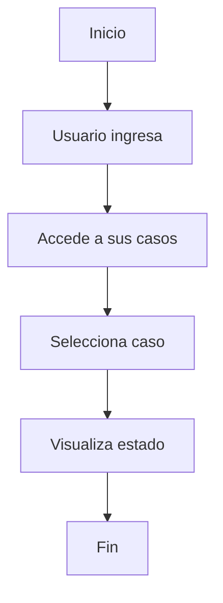
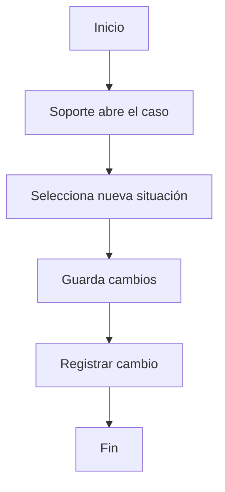
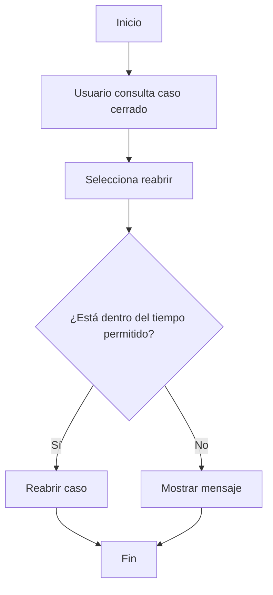
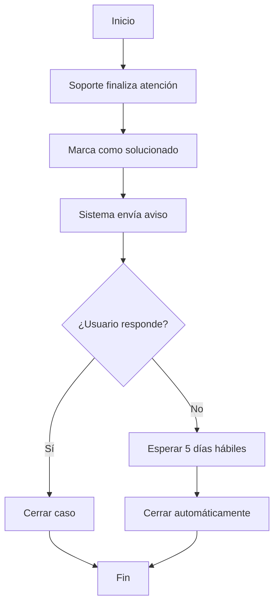
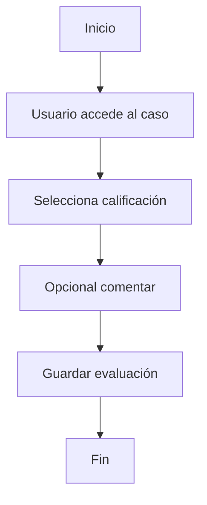
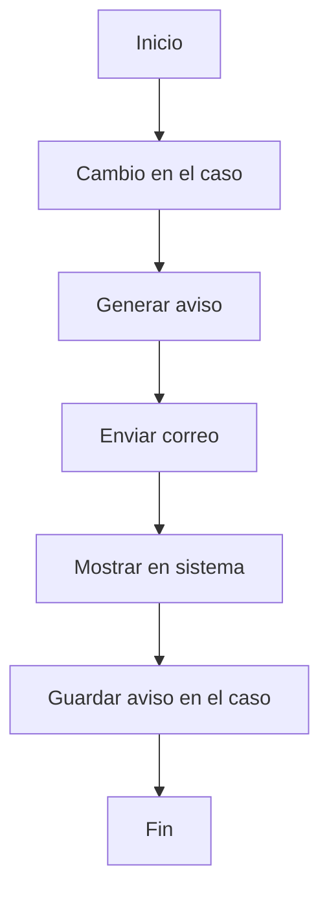

# Diagramas de Actividad

---

## 1. Registrar un caso de soporte

```mermaid
flowchart TD
A[Inicio] --> B[Usuario ingresa al sistema]
B --> C[Selecciona crear caso]
C --> D[Sistema muestra preguntas]
D --> E[Usuario responde información]
E --> F{¿Información completa?}
F -- Sí --> G[Enviar caso]
G --> H[Generar número de seguimiento]
H --> I[Fin]
F -- No --> J[Solicitar completar datos]
J --> D
 ```

---
## 2. Confirmación del caso

```mermaid
flowchart TD
A[Inicio] --> B[Usuario envía el caso]
B --> C[Sistema registra el caso]
C --> D[Generar número de seguimiento]
D --> E[Mostrar confirmación]
E --> F[Enviar aviso al usuario]
F --> G[Fin]
 ```

---

## 3. Atender un caso

```mermaid
flowchart TD
A[Inicio] --> B[Personal de soporte ingresa]
B --> C[Consulta casos pendientes]
C --> D[Selecciona un caso]
D --> E[Revisa información]
E --> F[Realiza atención]
F --> G[Cambia situación del caso]
G --> H{¿Se puede resolver?}
H -- Sí --> I[Marcar como solucionado]
I --> J[Fin]
H -- No --> K[Pasar a otra persona o área]
K --> J
```

---

## 4. Consultar estado del caso



---

## 5. Cambiar la situación del caso



---

## 6. Reabrir un caso



---

## 7. Cerrar un caso



---

## 8. Calificar la atención



---

## 9. Enviar avisos




```mermaid

```
