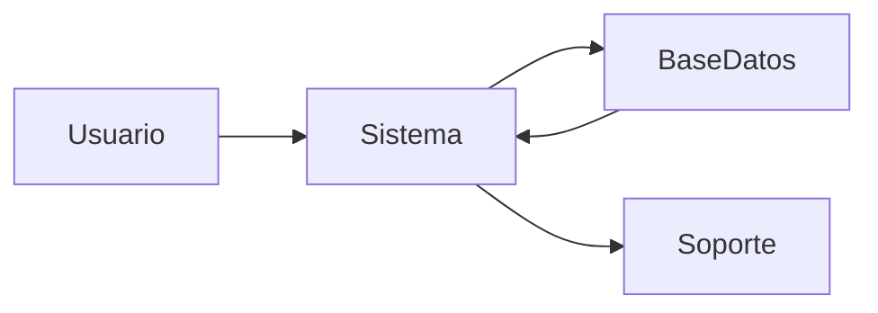
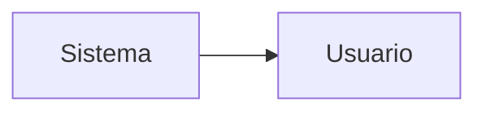
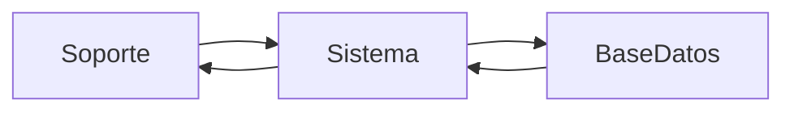
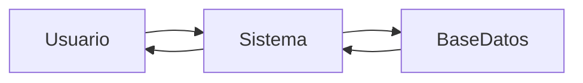
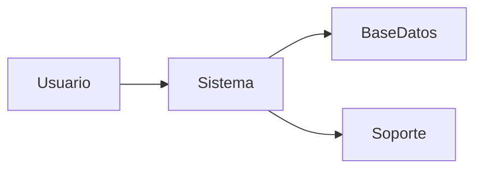
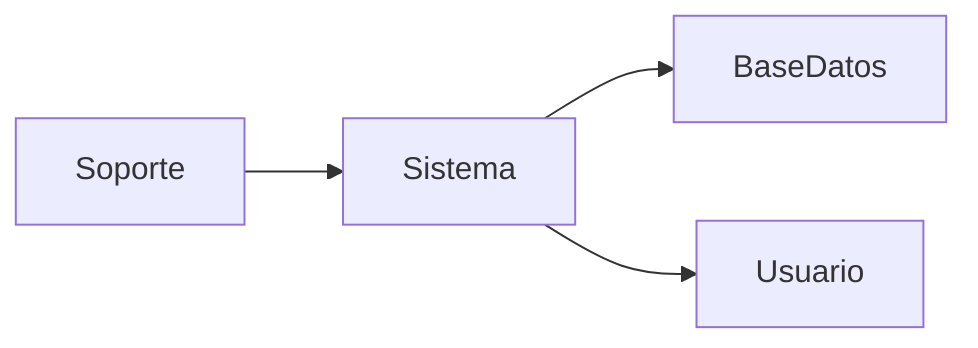
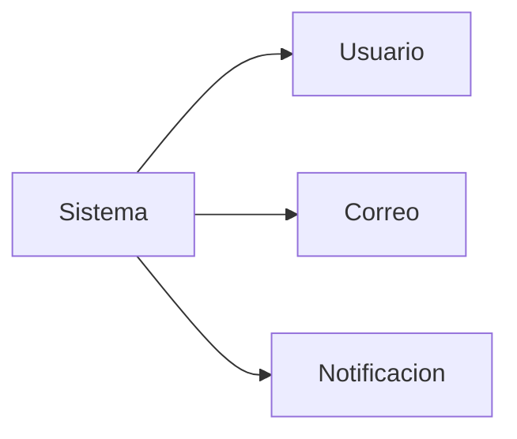

# Diagramas de Canal

--- 

## 1. Registro de caso (Usuario → Sistema → Soporte)



--- 

## 2. Confirmación del caso (Sistema → Usuario)



--- 

## 3. Atención del caso (Soporte ↔ Sistema)



--- 

## 4. Consulta del caso (Usuario ↔ Sistema)



--- 

## 5. Reapertura del caso (Usuario → Sistema → Soporte)



--- 

## 6. Cierre del caso (Soporte → Sistema → Usuario)



--- 

## 7. Envío de avisos (Sistema → Usuario)



--- 

##

```mermaid

```
